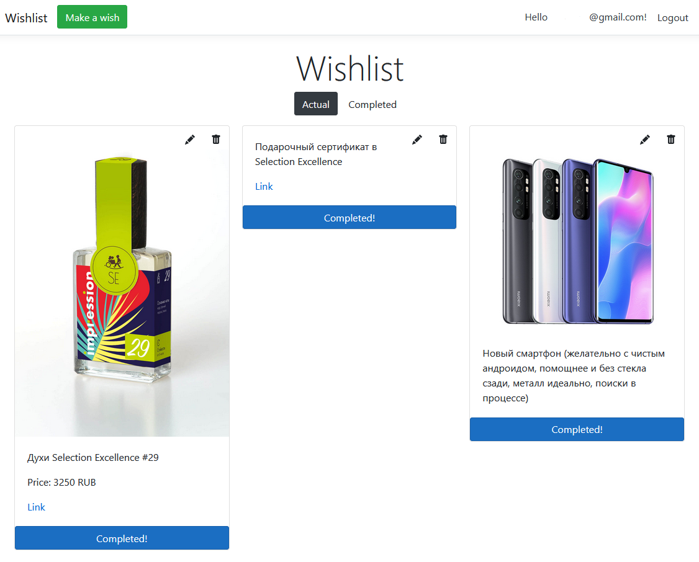

# ASP.NET Core wishlist adapted for Heroku
A single user wishlist web-site on ASP.NET Core 5.0 Razor Pages, adapted for deploying on Heroku. PostgreSQL via Entity Framework Core is used as a database, and Cloudinary is used as a file storage (with features for images resizing).

**Demo website**: <https://alt3rnata-wishlist.herokuapp.com/>

## Features

- wish cards are organised in nice masonry-like columns;
- description, image, price (with currency choice) and link may be added for a wish, all but description is optional;
- simple administration interface with ability to check a wish as completed, edit or delete it;
- switching between actual and completed wishes is implemented on JS without reloading the page;
- pages are responsive;
- in debug mode SQLite can be used for simplicity (just create right migration).

For deploying on Heroku I used this buildpack: https://github.com/jincod/dotnetcore-buildpack
Initial database migration is needed to be deployed todether with the application.
Note: I did not elaborated default login page yet, just prohibited other users registration.
